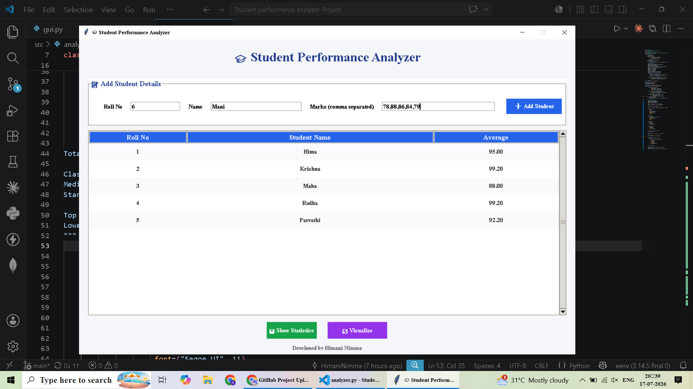
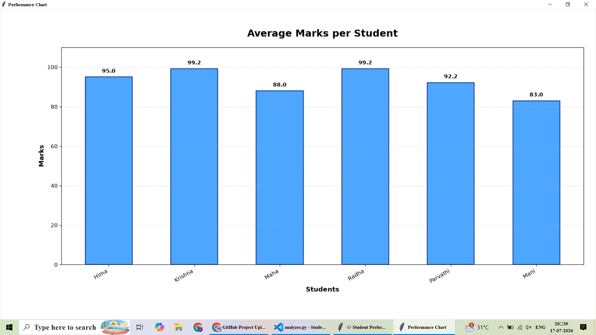
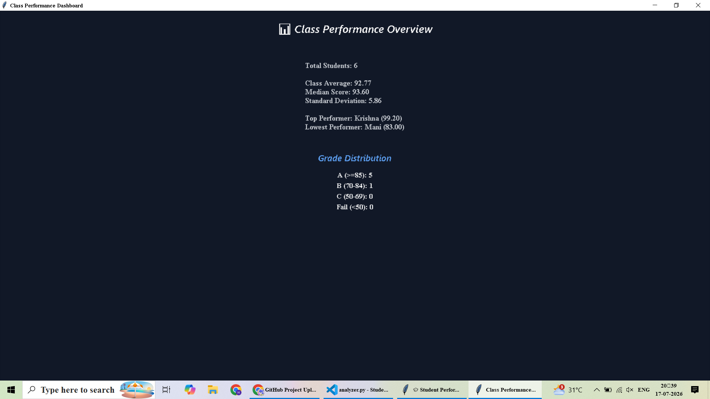

# 🎓 Student Performance Analyzer

<div align="center">

### A Modern Python Desktop Application for Student Performance Analysis

Built with **Python**, **Tkinter**, **Matplotlib**, and **Object-Oriented Programming**

</div>

---

## 📖 Overview

The **Student Performance Analyzer** is a desktop application developed using Python to manage and analyze student academic performance. It enables users to add student records, calculate average marks, generate class statistics, and visualize performance through graphs.

The project focuses on providing a clean graphical user interface while applying core Python concepts such as Object-Oriented Programming (OOP), data structures, exception handling, and data visualization.

---

## ✨ Features

- ➕ Add student details
- 📝 Enter marks for multiple subjects
- 📊 Automatically calculate average marks
- 📋 Display all student records in a professional table
- 📈 Visualize average marks using bar charts
- 📉 View class performance statistics
- 🏆 Identify top and lowest performers
- 📐 Calculate class average
- 📍 Calculate median marks
- 📏 Calculate standard deviation
- 🎨 Modern and user-friendly GUI

---

## 🖥️ Application Preview

### Main Window



---

### Performance Chart



---

### Statistics Dashboard



## 🛠️ Technologies Used

| Technology | Purpose |
|------------|---------|
| Python 3.x | Programming Language |
| Tkinter | GUI Development |
| ttk | Modern Widgets |
| Matplotlib | Data Visualization |
| Statistics Module | Statistical Analysis |
| OOP | Project Architecture |
| Git & GitHub | Version Control |

---

## 📂 Project Structure

```
Student_Performance_Analyzer_Project/
│
├── src/
│   ├── gui.py
│   ├── analyzer.py
│   └── student.py
│
├── Screenshots/
│
├── main.py
├── requirements.txt
├── README.md
└── .gitignore
```

---

## ⚙️ Installation

### 1️⃣ Clone the Repository

```bash
git clone https://github.com/HimaniNimma/Student_Performance_Analyzer_Project.git
```

### 2️⃣ Open the Project

```bash
cd Student_Performance_Analyzer_Project
```

### 3️⃣ Create Virtual Environment

```bash
python -m venv venv
```

### 4️⃣ Activate Virtual Environment

**Windows**

```bash
venv\Scripts\activate
```

### 5️⃣ Install Dependencies

```bash
pip install -r requirements.txt
```

### 6️⃣ Run the Project

```bash
python main.py
```

---

## 📊 Functionalities

- Add Student Records
- Store Subject Marks
- Calculate Average Marks
- Display Student Details
- Generate Class Statistics
- Visualize Performance Chart

---

## 📈 Statistics Generated

The application provides:

- Total Students
- Class Average
- Median Score
- Standard Deviation
- Top Performer
- Lowest Performer
- Grade Distribution

---

## 🧠 Concepts Used

- Object-Oriented Programming
- Classes & Objects
- Dictionaries
- Lists
- Loops
- Exception Handling
- Functions
- GUI Programming
- Data Visualization
- Statistical Analysis

---

## 🚀 Future Enhancements

- 💾 Save records to CSV
- 🔍 Search Student
- ✏️ Edit Student Details
- ❌ Delete Student
- 📑 Export Reports to PDF
- 📊 Export Data to Excel
- 🤖 Machine Learning Prediction
- 🌙 Dark Mode
- 🔐 Login Authentication
- ☁️ Database Integration

---

## 👩‍💻 Author

**Himani Nimma**

GitHub: https://github.com/HimaniNimma

---

## ⭐ Support

If you found this project useful, consider giving it a **⭐ Star** on GitHub.

It helps others discover the project and motivates future improvements.

---

## 📜 License

This project is developed for educational and learning purposes.

Feel free to use and modify it.
